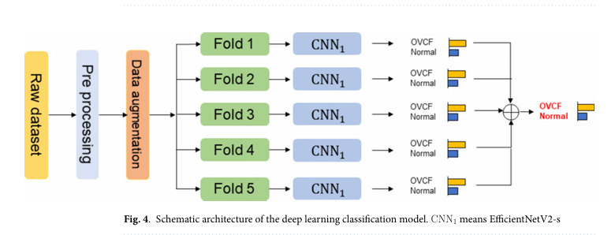

# Osteoporotic Vertebral Compression Fracture Detection using Deep Learning

This repository contains code for the study:

**Comparative efficacy of anteroposterior and lateral X-ray based deep learning in the detection of osteoporotic vertebral compression fracture**  
📄 *Scientific Reports (2024)*  
🔗 https://doi.org/10.1038/s41598-024-79610-w

## 🧠 Abstract

> Magnetic resonance imaging remains the gold standard for diagnosing osteoporotic vertebral compression fractures (OVCF), but the use of X-ray imaging, particularly anteroposterior (AP) and lateral views, is prevalent due to its accessibility and cost-effectiveness. We aim to assess whether the performance of AP images-based deep learning is comparable compared to those using lateral images.  
> This retrospective study analyzed X-ray images from two tertiary teaching hospitals, involving 1,507 patients for the training and internal test, and 104 patients for the external test. The EfficientNet-B5-based algorithms were employed to classify OVCF and non-OVCF group. The model was trained with a 1:1 balanced dataset and validated through 5-fold cross validation. Performance outcomes were compared with the area under receiver operating characteristic (AUROC) curve.  
> The DL model showed comparable classifying performance with internal test data (N = 708, AUROC for AP, 0.915; AUROC for lateral, 0.953) and external test data (N = 104, AUROC for AP, 0.982; AUROC for lateral, 0.979), respectively. The other performances including F1 score and accuracy were also comparable. Especially, the AUROC of AP and lateral X-ray image-based DL was not significantly different (p for DeLong test = 0.604).  
> The EfficientNet-B5 algorithms using AP X-ray images shows comparable efficacy for classifying OVCF and non-OVCF compared to lateral images.

---

<p align="center">
  
</p>


<p align="center">
  
</p>


<p align="center">
  
</p>


---

## 📁 Files

- `medical.py` : Training script for OVCF classification.
- `medical_eval.py` : Evaluation script for the trained model.

## 🚀 Usage
> ⚠️ Note: Please modify the dataset path and model parameter paths in both train.py and eval.py before running. These are placeholders and must be updated according to your local environment.
### Training
```bash
python medical.py

